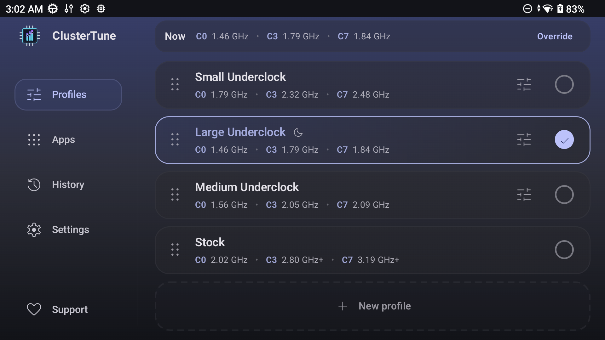
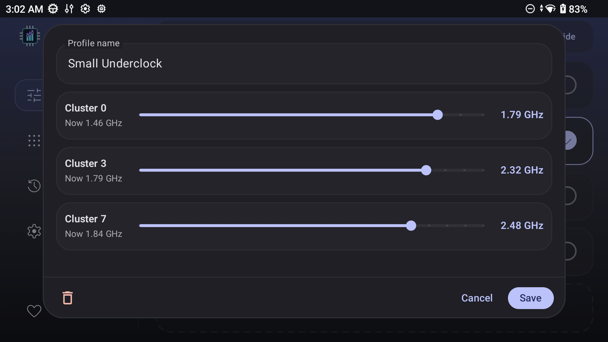
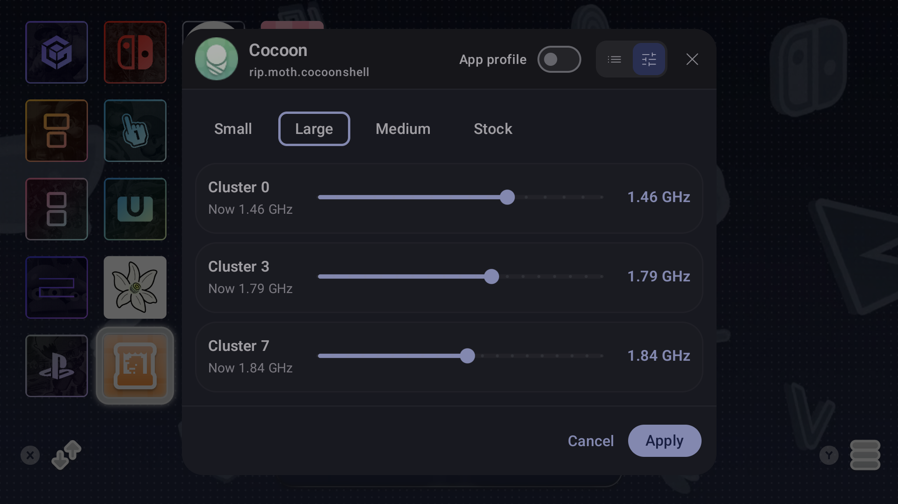
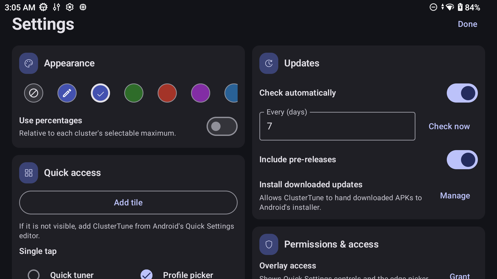

<h1>
  
  ClusterTune
</h1>


<a href="https://ko-fi.com/J3J518XVKR" target="_blank"></a>

ClusterTune sets maximum CPU and GPU frequencies on Android handhelds.

> [!WARNING]
> Changing CPU or GPU limits can affect stability, performance, temperature, and battery life. Start with tested values and use **Stock** to restore normal limits.

> [!NOTE]
> **Note for AYN users**
>
> The AYN Thor performance overlay can incorrectly display **3.19 GHz** when the CPU drops below **1 GHz**. ClusterTune 1.3.0 and later keep lower frequencies available under light load, making this display bug more noticeable. Check CPU-Z’s individual CPU readings before assuming underclocking has failed. See [issue #32](https://github.com/AurelioB/ClusterTune/issues/32) for details.

## Why underclock?

Lower CPU limits can reduce power use, heat, fan noise, and battery drain. Games limited by the GPU may also gain thermal or power headroom. This only caps clock speed and does not undervolt the CPU or replace its governor.

## Features

* Support for rooted Android 12+ devices through `su`
* Independent maximum frequency controls for each CPU cluster and supported GPUs
* Profiles that can be created, reordered, imported, and exported
* Bundled presets and a Stock profile for supported processors
* Automatic app profiles using saved profiles or custom frequency values across one or more displays
* Per-app Auto Tune targets in a dedicated overlay tab, with a slider capped to the app display's current refresh mode, using SurfaceFlinger frame statistics and device load to lower available CPU/GPU ceilings safely
* Quick Settings access to pick, tune, or cycle profiles
* A left edge gesture that opens profile controls over the current app
* Optional profile automation after boot and while asleep
* A history of automatic profile switches

## Compatibility

Version 1.0 adds support for rooted devices, expanding compatibility beyond AYN and Retroid hardware.

| Method | Devices |
| --- | --- |
| **PServer** | AYN and Retroid devices with the built in PServer service, except Odin 2 Mini |
| **Root** | Any Android 12+ device with a working `su` shell |

Detection tries PServer first, then Root. The Odin 2 Mini must use Root. If neither method is available, tuning cannot be applied.

## Install

Download [v1.3.0](https://github.com/AurelioB/ClusterTune/releases/tag/v1.3.0) and install `ClusterTune-v1.3.0.apk`.

Android may ask the browser or file manager for permission to install the APK. **Install downloaded updates** is separate and optional. It is only needed for updates installed from inside the app.

## Setup

Execution method detection runs on first launch. Approve the `su` request if Root is selected. Any missing access is listed with a shortcut to the correct Android settings page.

| Access | Purpose |
| --- | --- |
| **Display over other apps** | Opens profile controls over the current app. |
| **Accessibility** | Detects visible apps immediately for automatic profiles. |
| **Notifications** | Keeps app profile and sleep automation active. |
| **Usage access** (optional) | Improves recent app sorting when choosing an app. |

Background features share one persistent **ClusterTune is tuning your clusters** notification. It remains while any overlay, HUD, sleep-monitoring, or boot-restoration service is active.

Choose a bundled profile or create one. **Stock** restores the device's normal maximum frequencies.

On compatible devices, manual CPU underclocks also protect the lowest supported minimum frequency against system services overwriting it. Protection requires a root-owned privileged host, supported CPU frequency controls, and access to manage their permissions; it is not restricted by device model or firmware fingerprint. Returning a cluster to **Stock** restores its maximum and releases minimum write protection. The system can then reapply its chosen minimum; devices without a service that does this retain the lowest supported floor until it is changed. ClusterTune does not replay a captured effective minimum, which could include a temporary boost. Closing the main window keeps the background services and protection active. Protection is released if the app process actually ends or the privileged host is explicitly stopped. If the privileged service is forcibly killed, its replacement recovers the original permissions when ClusterTune reconnects; reboot also resets them. Independent system boosts can still raise the effective minimum. Physical validation so far used an AYN Thor; see the [implementation and device test results](docs/minimum-frequency-research-2026-10-02.md#production-integration).

Auto Tune is experimental and disabled by default. Turn on **Enable autotune settings (experimental)** in Settings to show the Auto Tune tab in app-profile dialogs and the overlay, and the Performance HUD option for the Quick Settings tile. Turning it off hides both options, closes an open HUD, stops active automatic tuning with the usual frequency restoration, and keeps saved Auto Tune assignments inactive until re-enabled. If the tile was set to the HUD, it opens the quick tuner while the option is disabled; re-enabling restores the saved HUD choice.

For an app profile, open the overlay's **Auto Tune** tab and use the target slider to let ClusterTune search for lower maximum frequencies while that app owns the focused window. The slider follows the current refresh mode of the display hosting the app, so a device switching between 60 and 120 Hz never asks Auto Tune to chase frames the panel cannot present. Saved targets accept any positive FPS value for portability; at runtime ClusterTune uses the lower of that value and the app display's current refresh rate without rewriting the saved preference. The target is a performance floor, not a frame-rate limiter; for best efficiency, set the app's own frame-rate cap to the same value.

Auto Tune writes only maximum-frequency ceilings. On a confidently identified three-cluster topology it leaves the efficiency CPU policy at its assigned baseline and tunes the performance, prime, and GPU domains; ambiguous and one/two-policy devices keep every discovered CPU policy available. It never writes CPU/GPU minimum frequencies or governors, even when an OEM performance mode holds a minimum above the selected ceiling; that domain may temporarily run pinned at the ceiling while it is busy. ClusterTune never requests a ceiling above the saved normal profile and restores only the maximum ceilings and permissions it still owns when the session ends. If an OEM restores a ceiling upward to a recognized hardware Stock value, Auto Tune stays active and its next normal tuning step can apply the complete adaptive envelope again; a lower, unknown, or permission-changing external override still stops the session. SurfaceFlinger frame statistics are required. Auto Tune bases its decisions on frame performance and CPU/GPU utilization; temperature readings remain observational, while the device's own thermal management controls protection and throttling.

CPU and GPU ceilings are device-wide. In multi-window or multi-display use, the focused Auto Tune app owns the adaptive session; fixed assignments on other visible displays do not constrain that session. Applying a profile manually pauses Auto Tune for the current foreground ownership; it can start again after the focused app or its assignment changes.

Auto Tune waits through static menus or loading screens that produce no fresh frames and resumes when rendering returns. It raises ceilings promptly when performance falls short, while checking reductions for regressions. Quick Settings shows the active profile or Auto Tune FPS target.

## Screenshots

| Main app | Profile editor |
| --- | --- |
|  |  |

| Quick tuner overlay | Settings |
| --- | --- |
|  |  |

## Troubleshooting and support

* No execution method found: confirm that PServer is available or that the root manager provides `su`, then run detection again from Settings.
* Profile controls missing: check Display over other apps.
* Assigned app not switching profiles: confirm its assignment, Accessibility, and Notifications.
* **App automation needs attention**: accessibility access is still enabled, but the service is disconnected or its app-detection worker is unhealthy. In Accessibility settings, turn ClusterTune's app profile service off and on. If it recurs after closing the app, check the device's background activity or battery restrictions. ClusterTune retries transient window/storage failures and waits briefly before showing this message. See the [accessibility audit](docs/accessibility-audit-2026-10-02.md) for tested recovery paths and remaining limits.
* Auto Tune stops while an app is open: check the Auto Tune status card. Some vendor builds do not expose usable SurfaceFlinger frame statistics or GPU telemetry; include the reported frame backend and error when filing an issue.

For help, open a [GitHub issue](https://github.com/AurelioB/ClusterTune/issues) with your device model, Android version, execution method, and the relevant log details. Please do not include private data.

## Build and test

Building uses the configured JDK 21 daemon toolchain and Android SDK 34 (the app targets Java 17 bytecode):

```bash
./gradlew testDebugUnitTest
./gradlew lintDebug
./gradlew assembleDebug
```

The debug APK is written to `app/build/outputs/apk/debug/`.

## License and attribution

Distributed under the GNU General Public License v2.0.

The RootExec/PServer command execution code is based on [O2P Tweaks](https://github.com/FeralAI/o2ptweaks.app) by FeralAI, also licensed under GPLv2.

The project was inspired by the [Odin 3 CPU Underclock](https://github.com/TheOldTaylor/Odin3-CPU-Underclock) scripts and the original idea shared by Reddit users [u/twoohfive205](https://www.reddit.com/user/twoohfive205/) and [u/JoaozaoS](https://www.reddit.com/user/JoaozaoS/).

## AI assistance disclosure

AI assistance was used while building this project. I reviewed the code throughout development and understand how the app works and what it does.
